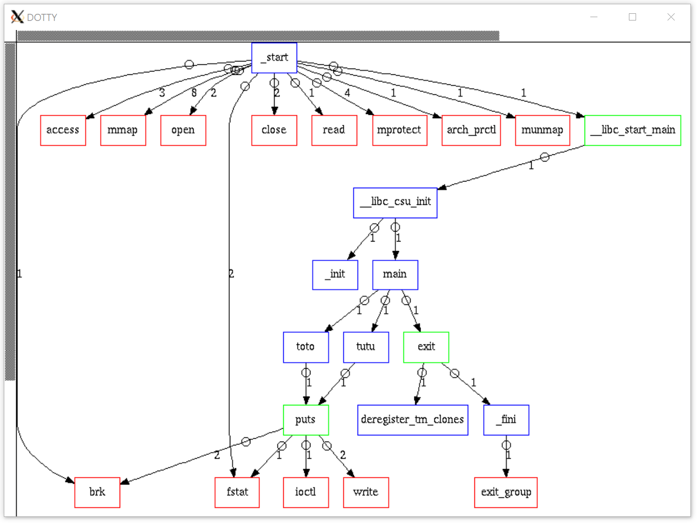

# Ftrace

Ftrace is a C executable. It's like the tracing framework of Linux : [ftrace](https://en.wikipedia.org/wiki/Ftrace).



## Requirements

Building the Ftrace executable requires the following tools:
- X.org graphic system (see [www.x.org](https://www.x.org/wiki/))
```bash
sudo apt-get install xorg
```
- Dotty graph visualization software (see [www.graphviz.org](http://www.graphviz.org/))
```bash
sudo apt-get install graphviz-dev
```
- Executable and Linkable Format library (see [Wikipedia page](https://fr.wikipedia.org/wiki/Executable_and_Linkable_Format))
```bash
sudo apt-get install libelf-dev
```

## Compilation

To build the executable, use:
```bash
make all
```

## Usage

To launch the executable, use:
```bash
./ftrace [-p pid] [command [arg ...]]
```

The `[-p pid]` option allows you to trace an executable with his pid. Otherwise you can execute it directly within the arguments with `[command [arg ...]]`.

### Syscalls

To generate a new syscall list used by Ftrace, use:
```bash
./syscalls_tab.sh
```

This executable updates the [`syscalls_tab.c`](syscalls_tab.c) file:
```C
#include <asm/unistd_64.h>
#include <stdlib.h>
#include "ftrace.h"

t_tab    syscalls_tab[] =
  {
    {__NR_read, "read"},
    {__NR_write, "write"},
    {__NR_open, "open"},
    {__NR_close, "close"},
    ...
```

### Example

```bash
./ftrace ./fct_test
```

## License

Distributed under the [Apache License, Version 2.0](http://www.apache.org/licenses/). See [`LICENSE`](LICENSE) for more information.
